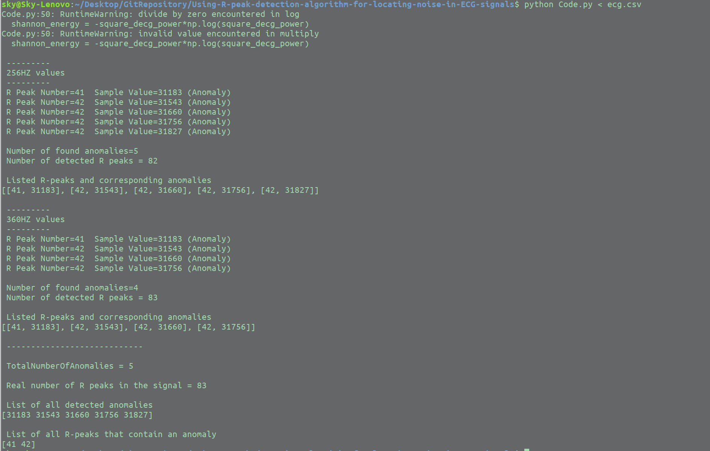

INFO
=====
This is a program used to locate Anomalies/Noise in ECG/EKG signals.
It prints relevant data in Terminal, and draws a Graph showing the detected Anomalies/Noises 

INSTRUCTIONS
=============

First go to the project file and
start the [*Code.py*] by using following command

`python Code.py < ecg.csv` 

In this case [ecg.csv] is just a sample data in a format convenient to test-run the program.

**##GRAPH**

In file [MIT-BIH] you can find array of ECG signals to work with. Inside there are also "Split" files, where large signals have been cut into tme frames of 80 seconds.

**Note:** Python version I used is 2.7.17

